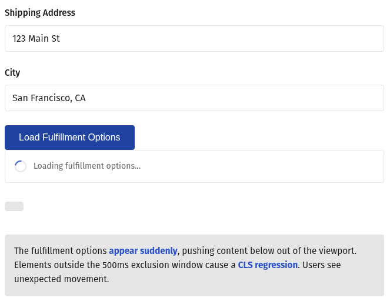
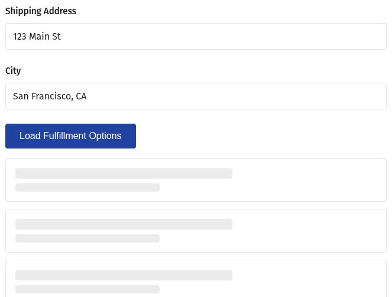

Sometimes, performance indicators such as the ones measured in **Lighthouse** may be considered vanity metrics. The reality is that a lot of research is made in defining the thresholds in which each of these start to impact the **user experience** and, as consequence, the **conversion** and **revenue**.

## Lighthouse metrics and their meaning

Lighthouse on its own will mostly focus on page load metrics, which will define how quickly the content was fetched from the server (**TTFB**), how long did it take for the something to be painted to the viewport (**FCP**), and how long did it take for the largest element above-the-fold to be painted (**LCP**).

Besides these basic metrics, a few others have key impact in the score, like: the **TBT**, which indicates how long did the main thread got blocked during the page load to evaluate and run scripts; and the Cumulative Layout Shift (**CLS**), which indicates the layout stability or, in other words, the unexpected change in position from elements in the viewport.

Between all of these, CLS is different in nature, because it's value is captured not only during page load, but throughout the whole session, and this fact makes CLS closer to another important performance metric: Interaction to Next Paint (**INP**). INP indicates how long will the page take to respond to user input, such as clicking a button, hovering an element, pressing a key, etc. One can read this as the page "responsiveness".

> Note: CLS will only take into account elements moving when visible in the viewport.

## Intricacies when fixing poor scores

Now, a funny thing about this couple of metrics is that they can be sometimes _intertwined_!

CLS governs _layout stability_ and rewards UIs in which elements remain put. However, in modern (dynamic) web apps, its expected that things will move around, for instance, when the user clicks an arrow button and an accordion expands, causing all elements below it to move (shift).

To prevent expected position changes to hurt your scores, layout-shifts which happen less than **500ms** after user interactions like clicking, focusing, or typing, are not taken into consideration. This timespan is known as **Exclusion Window**, and these actions are called **discrete**.

The correlation with INP comes in the sense that the exclusion window lies in the responsiveness _thresholds_, so if your average score is below **200ms**, considered Good, it is unlikely that your CLS scores will be affected by this. On the other hand, if you have slower interactions, you'll probably need to deal with both metrics at once.

So, CLS and INP can move together in either direction, great! But what if they don't? There are edge cases in which even if the INP is in a good stance, your CLS scores might be suffering.

One example is when async operations are taking longer to be fulfilled, crossing the exclusion window and causing elements to be pushed out of place when data comes in, droping the session CLS scores. An interesting way to solve that problem is to apply skeleton loaders, since they will save room for the UI elements that are going to be displayed, and will move elements below that within the exclusion window, avoiding CLS drops.

## Skeletons in Action

To give a practical example, let's picture a common use case:

Let's say we have an order request form, and that the fulfillment options are loaded dynamically from a third-party API once the user finishes setting up their addresses:

> The button is used in the example to connect the two metrics

If we opt to only show a loading spinner next to the "Fulfillment" title and the API request takes longer to respond, your CLS scores will suffer. If you choose to show nothing while it loads, the UI will seem unresponsive, and your INP will suffer.

The solution is to make room for the fulfillment options by using a skeleton loader component that occupies roughly the same height, preserving the position of the elements below it.

Since all shifts will occur within the exclusion window, CLS and INP scores will keep controlled, the the UX preserved. More about that below!

## CLS and INP impact on UX

In this scenario you may be wondering why would anyone consider the new data being rendered to the screen an issue. Isn't the user expecting the data to be displayed? And this feeling is correct! CLS is not measured against new elements on the UI, but the impact it can cause on other elements that were in the viewport before.

In the example above, more options could be visible while the data was loading, and it would be possible for an user to hover a button cancel the order, and suddenly that button gets pushed out of view, replaced by the fulfillment lines; then, he ends up clicking that instead. This is the kind of friction that CLS helps us to identify.

A similar takeaway can be extracted by analyzing INP. If the UI didn't respond to an interaction, it's probable that the user will feel like his action was not recognized, especially if they are on a mobile device with touch-screen.

This is why we need to carefully review each interactions/events are tracked with poor scores, so we can improve for CWv and ensure our users are having the best experience possible, having little to no friction to convert through each step in the funnel.

## Conclusion

Optimizing for performance may sometimes get tricky, especially when it comes to session-related metrics like INP and CLS, for which we must track down customer behavior and identify which interactions or events led to score regressions. But if we apply a systematic approach to cover edge cases and plan the UI in a way that it smoothly changes over time, those aggressors get mostly mitigated.

It's important to also implement a good telemetry tool, like Sentry, which provides a flexible platform to customize tracking and identify CWV regressions based on Real-Users Monitoring.
